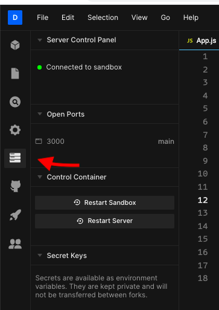
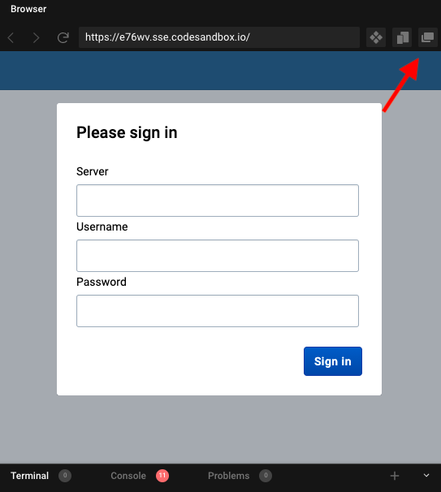

# CodeSandbox

The exercises in this workshop should all include links which will open the relevant code directory in CodeSandbox.  

Here are a few steps to follow every time you open a CodeSandbox project for this workshop:

- Once you've opened a CodeSandbox link (like [this one](https://codesandbox.io/s/reverent-sea-e76wv)) you need to [fork the project](#fork-project) before you can edit it (you will be required to sign-in using a GitHub account or email before you can fork)
- Some tasks will require you to [open a terminal](#terminal) and run shell commands.
- If you want to view the application in the full browser (while still reloading when code changes) you can [show the app full-screen](#full-screen-app)

## Prerequisites
To use [CodeSandbox](https://codesandbox.io) for this academy, you will need to have a GitHub account, and login to code-sandbox using that account.

## Fork a CodeSandbox project
Once a project is running in CodeSandbox, it will be in read-only mode. In order to make any changes to the code you will have to fork the project. To do so, simply click on the button saying **"Fork"**.

> NOTE: You will need to **sign in** first using a GitHub account or email before you can fork 

## Open a terminal window to issue commands
The panel that holds the terminal window is right at the bottom of the screen. If it is not visible at, you can click the icon in the bottom-right to expand that panel. The main terminal window is read-only, so you will have to open an additional one by clicking on the `+` icon on the right.

## Restarting the server
If you run into any issues, it might be useful to restart the server, or even the entire sandbox. You would need to do this for some exercises as well. To do so, first click on the "Server Control panel" tab on the left and then click on "Restart server" or "Restart sandbox".

## Show the app full-screen
By default the running app will be displayed in a panel within the CodeSandbox IDE. If you have limited screen dimensions, that might not be a convenient layout for you. An alternative would be to open the running app in separate browser window and reduce the size of the app panel dramatically:
- To open the app in a separate window, simply click the button on the top right of the preview window. Fun fact: this window will also auto-reload when you save changes to files.
- To create more space in the CodeSandbox IDE, you can simply resize the different panels to suite your needs by dragging their edges.

