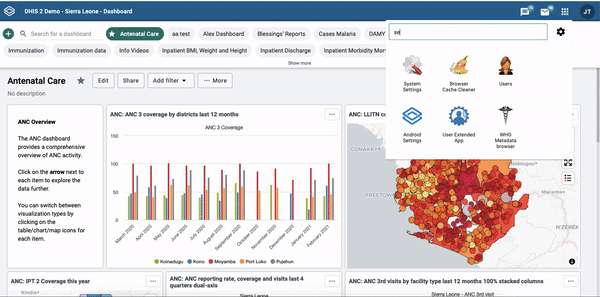

# Live instance debugging 

If you can't login to the server: https://academy.demos.dhis2.org/web-app/ or you get some Cross-Origin Resource Sharing (CORs) policy issues in the DevTools Console when trying to connect to your application, please try the following troubleshooting steps: 

##  CORs whitelist

If you have a DHIS2 instance, by default only web applications that are running on the same URL can access that DHIS2 instance. 

In your DHIS2 instance, there's a **CORs whitelist** option that can be configured to add other URLs besides the current one and allow that DHIS2 application instance. 

> **Note:** This has already been configured for that academy instance but it's still important to know about this option for future reference. 

When you login to your instance, click on the apps icon and search for **System Setting** application. Then go to **Access** from the menu on the left and scroll down to see the **CORs whitelist** option. There you can add the URLs that you want to grant access. 

See below:

## If you're using Chrome 

There are a few things that you could do if you're using Chrome and the problem persists: 

### SameSite by default cookies flag

Disable the default SameSite Cookie behavior in Chrome by setting the "SameSite by default cookies" flag [chrome://flags/#same-site-by-default-cookies](chrome://flags/#same-site-by-default-cookies) to **Disabled**. You may need to restart your browser to apply the new setting. 

**Note**: this disables legitimate security behaviors in your browser, so proceed with caution! We recommend that you only disable this flag when actively debugging a DHIS2 application. 

Read this blog to learn more about [SameSite Cookie Policies and DHIS2 Applications](https://developers.dhis2.org/blog/cross-origin-cookies).  

### Disabling cache

You could also try disabling the cache from the network tab in Chrome DevTools. See below:

Hopefully you're now able to connect. If you encounter different errors, please let us know! 

