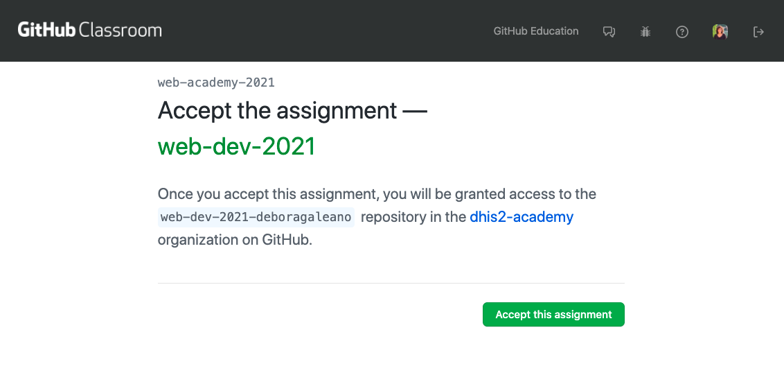
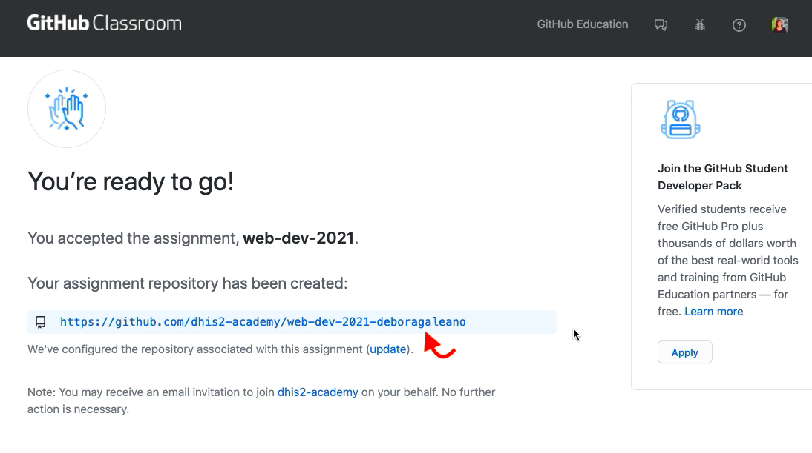

# Get Started

This guide will help you get started with GitHub Classroom and will show you how to setup your local environment for working and submitting your assignments. 

## GitHub Classroom: Accept assignment

When you receive the invitation link, you will see the following: 



Once you accept the invitation, a GitHub repository will be created for you. **Refresh** the page to see your repo. Note that your username will be automatically added as shown below: 



Next, let's setup your local environment. 

##  Setup local environment 

* From your repository page on GitHub, click the green button **Clone** in the “Clone with HTTPs” section, then copy the URL for your repository. 

* Next, on your local machine, open your terminal and change your current working directory to the location where you would like to clone your repository (for example: `cd Documents`)

* Once you have navigated to the directory where you want to put your repository, run the following:

```sh
git clone https://github.com/dhis2-academy/web-dev-2021-YOUR-NAME.git
```

The `git clone` command copies your repository from GitHub to your local computer. 

## Working on assignments

* On your terminal, navigate to the specific assignment directory

* To work on a specific directory, navigate to that location `cd name-of-directory` 

### Working on directories that contain starter code

**Note:** Most directories like the `02-ui-library` and the `03-app-runtime` (within `workshop-1`) will contain basic boilerplate code for you to get started with. Follow these steps to setup your working directory: 

* First, navigate to the directory:

```sh
cd 02-ui-library
cd 02-ui-library-task-template
```

* Run `yarn` to fetch all packages and dependencies.

```sh
yarn 
```

You are now ready to start your application locally! 

### Start your DHIS2 application locally 

* Run `yarn start` - This will run the app in the development mode.

```sh
yarn start 
```

* From the browser, go to [http://localhost:3000](http://localhost:3000). You will see the following page: 


* Before you sign in, you need to log in to the DHIS2 instance which will be your **server**: 
  - Go to: https://academy.demos.dhis2.org/web-app/ 
  - You will see this page:

  - Sign in as username: `admin` and password: `district`

* Finally, go back to [http://localhost:3000](http://localhost:3000) and enter the following:

```
server: https://academy.demos.dhis2.org/web-app/
username: admin
password: district
```

* You should now be able to see your application on the browser. By default the page will look like this:


> **NOTE**: If you're getting some errors and can't connect to the server or you're unable to sign in, please check these possible [solutions](./DEBUG.md)

## How to submit assignments 

Before you start working on the assignments, you will need to create a new branch in your repository for each task. Then, you will work on this branch and open a pull request once you're done. If you're familiar with feature-driven or branch-based development, this is a very similar process. The task workflow would therefore look like this:

1. Create a new branch
2. Work on this branch
3. Open a Pull Request 
4. Receive review from instructors 
5. Merge your Pull Request to `main`
   
### Create a new branch 

* You can [create a branch](https://docs.github.com/en/github/collaborating-with-issues-and-pull-requests/creating-and-deleting-branches-within-your-repository#creating-a-branch) on your GitHub repository. Make sure to name your branch as the task name. For example, `02-ui-library`
* Or from your terminal: 

```
git checkout -b new-branch
or
git checkout -b 02-ui-library 
# A new branch 02-ui-library will be created 
```
* Work on your assignments - make sure you're working on that same branch  

### Commit and Push changes 

* Once you're done, commit and push the changes to your remote repository: 

```
git add .
git commit -m “<type-commit-message>”
git push origin <branch-name>
```

### Create a Pull Request

* Once you push the changes to your repository, the **Compare & pull request** green button will appear on GitHub. Click and follow the instructions. Add the name of the assignment `02-ui-library` as the title of your pull request and leave a comment
* Open a pull request by clicking the `Create pull request` green button

### Instructors will review your PR

* Instructors will be able to see your submission and provide feedback from the GitHub Classroom ✍🏽

### Merge your PR

* After you've received your PR review, you'll be able to merge your it to your `main` in your repository ✨ 

