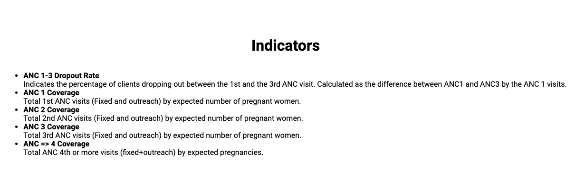

# Workshop 1 - App Runtime Task 1

## Useful Links

* [DHIS2 Application Runtime](https://runtime.dhis2.nu/#/)
* [How to work on assignments](../../../resources/GET_STARTED.md#working-on-directories-that-contain-starter-code): Follow instructions on how to  start working on assignments. 


## Tasks 

* Here you would need to write a query and define some parameters 

```js
const query = {
    results: {
        // @TODO: Writa a query to show 5 indicators with their name and description
    },
}
```
* Finally, you would need to use that query defined above to render your data 👇 

```js
export const IndicatorsList = () => {
    // @TODO: Replace this line with a hook to perform the above query!
    const { loading, error, data } = { loading: false, error: 'Unimplemented', data: undefined } 
}
```
## Solution:

* After you've completed these tasks, your application should look like this:

 

### Submit your assignment 

When you're ready, please follow these [instructions](../../../resources/GET_STARTED.md#how-to-submit-assignments) to submit your assignment. 